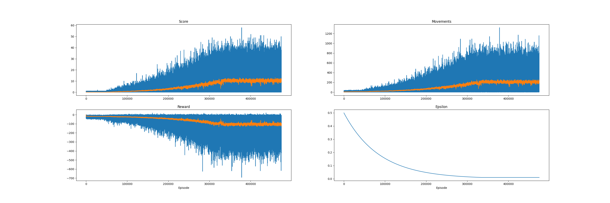

# SnakeSolutions

This repository comprises a collection of reinforcement learning-based solutions for the vanilla Snake Game and other game variations. Using mainly pygame, openAI gym, and PyTorch, this project aims to provide a platform for experimenting with different reinforcement learning algorithms and game environments.

<p align="center">
  
</p>

## Installation

To install the required dependencies for the repository, you can use pip. Make sure you have Python3.10 and pip installed on your system.

1. Open a terminal or command prompt.
2. Navigate to the root directory of the SnakeSolutions project.
3. Run the following command to install the requirements:

    ```bash
    pip install -r requirements.txt
    ```

    This command will install all the necessary packages listed in the `requirements.txt` file.

Once the installation is complete, you can proceed with running the SnakeSolutions program.

## Playing the Snake Game

To play the Snake Game manually, you can use the provided `play_snake.py` script.

1. Make sure you have completed the installation steps mentioned above.

2. Open a terminal or command prompt.

3. Navigate to the root directory of the SnakeSolutions project.

4. Run the following command to start playing the Snake Game:

    ```bash
    python src/play_snake.py
    ```

    This command will launch the Snake Game interface, allowing you to control the snake using the arrow keys.

5. Enjoy playing the Snake Game and try to achieve the highest score!


## Training the Snake AI

To train the Snake AI models, you can use the `train_snake_IA.py` script.

1. Make sure you have completed the installation steps mentioned above.

2. Open a terminal or command prompt.

3. Navigate to the root directory of the SnakeSolutions project.

4. Run the following command to start training the Snake AI models:

    ```bash
    python src/train_snake_IA.py
    ```

    This command will initiate the training process and start training the AI models using reinforcement learning algorithms. Use the -h flag to have a more detailed description of the available arguments.
        

5. Wait for the training process to complete. The duration may vary depending on the complexity of the training settings and the hardware resources available. It may take several hours to train the AI models using the default settings. If you want to have more information about the training progress, the metrics.png file in the models folder will show several training metrics.

<p align="center">
  
</p>

Once the training is finished, you can use the trained AI models to play the Snake Game or evaluate their performance.

## Evaluate the Snake AI Model

To evaluate the performance of the trained Snake AI models, you can use the `evaluate_snake_IA_model.py` script provided in the SnakeSolutions project.

1. Make sure you have completed the installation steps mentioned above.

2. Open a terminal or command prompt.

3. Navigate to the root directory of the SnakeSolutions project.

4. Run the following command to start evaluating the Snake AI model:

    ```bash
    python src/evaluate_snake_IA_model.py <model_name>
    ```

    Replace `<model_name>` with the name of the model you want to evaluate. This should be the name of the saved model file without the file extension.

    For example, if you have a model named `snake_model.pth`, the command would be:

    ```bash
    python src/evaluate_snake_IA_model.py snake_model
    ```

    This command will load the specified model and evaluate its performance by running multiple games of Snake using the trained AI model.

5. Observe the evaluation results, which may include metrics such as average score, highest score, and game duration.

Note: Make sure you have the necessary dependencies installed and the model file is located in the correct directory before running the evaluation script.


## Testing the Snake AI Model

To test the trained Snake AI models, you can use the `test_snake_IA_model.py` script provided in the SnakeSolutions project.

1. Make sure you have completed the installation steps mentioned above.

2. Open a terminal or command prompt.

3. Navigate to the root directory of the SnakeSolutions project.

4. Run the following command to start testing the Snake AI model:

    ```bash
    python src/test_snake_IA_model.py <model_name>
    ```

    Replace `<model_name>` with the name of the model you want to test. This should be the name of the saved model file without the file extension.

    For example, if you have a model named `snake_model.pth`, the command would be:

    ```bash
    python src/test_snake_IA_model.py snake_model
    ```

    This command will load the specified model and run the Snake Game using the trained AI model.

5. Observe the Snake Game being played by the AI model and evaluate its performance.

Note: Make sure you have the necessary dependencies installed and the model file is located in the correct directory before running the test script.

## Models and Results

The following table shows the performance metrics of the different Snake AI models:

| Model | Average Score | Max Score |
|-------|---------------|-----------|
| DQN   | 18.88         | 52        |
| DDQN  | 0             | 0         |

The results were obtained after playing 1000 games in a 300 border size game.
